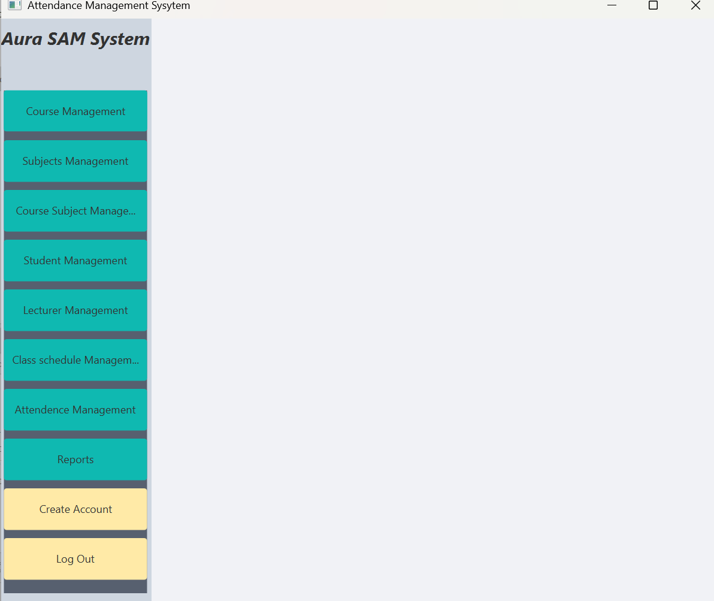
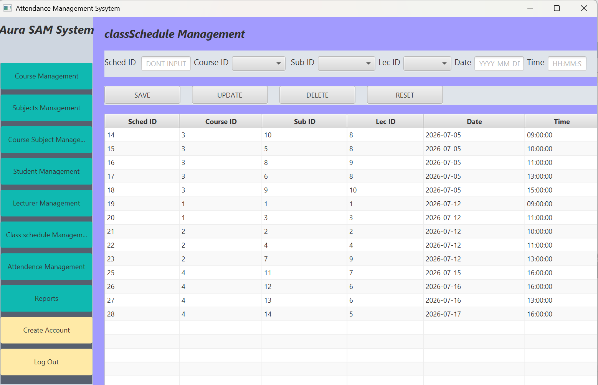

# AuraSAMS

## Screenshots


### Admin Dashboard



### class Schedule




## Aura Student Attendance Management System

### Project Overview

AuraSAMS (Aura Student Attendance Management System) is a JavaFX-based desktop application developed to manage student attendance efficiently within educational institutions.

The system enables administrators and lecturers to manage courses, students, lecturers, class schedules, attendance records, and attendance reports through a secure role-based access control mechanism.

The application follows Object-Oriented Programming principles and Layered Architecture to ensure maintainability, scalability, and code organization.

---

## Features

### Administrator Features

- User Authentication
- Course Management (CRUD)
- Student Management (CRUD)
- Lecturer Management (CRUD)
- Class Scheduling
- Attendance Report Generation
- System Monitoring

### Lecturer Features

- Secure Login
- View Assigned Classes
- Mark Student Attendance
- Update Attendance Records
- View Attendance Information

---

## User Roles

### Admin

Administrators have full access to the system and can manage all available modules.

**Username Rule:**
- Username must begin with `ADM`

### Lecturer

Lecturers have access only to attendance-related functionalities assigned to them.

**Username Rule:**
- Username must begin with `LEC`

---

## Technologies Used

### Programming Language
- Java

### User Interface
- JavaFX

### Database
- MySQL

### Database Connectivity
- JDBC

### Version Control
- GitHub

### Development Environment
- NetBeans IDE
- Scene Builder

---

## System Architecture

The system follows a Layered Architecture consisting of:

### Presentation Layer
Responsible for user interfaces and user interactions.

### Service Layer
Handles all business logic and system operations.

### Data Access Layer
Responsible for communication between the application and database.

### Data Layer
MySQL database used to store and manage system data.

---

## Database Information

### Database Name

```sql
auraeducation
```

The database contains tables related to:

- Users
- Students
- Lecturers
- Courses
- Subjects
- Class Sessions
- Attendance Records

---

## Setup Instructions

### Step 1

Install the following software:

- JDK
- NetBeans IDE
- Scene Builder
- MySQL Server
- MySQL Workbench

### Step 2

Create a database named:

```sql
auraeducation
```

### Step 3

Import the provided SQL script into MySQL.

### Step 4

Open the project using NetBeans IDE.

### Step 5

Configure the JDBC database connection settings if necessary.

### Step 6

Build and run the project.

### Step 7

The Login Screen will appear first.

### Step 8

Login using one of the available user accounts.

After successful authentication, system functionalities will be displayed according to the logged-in user role.

---

## Login Credentials

### Administrator Account

Username:

```text
ADMpasan
```

Password:

```text
11223344
```

### Lecturer Account

Username:

```text
LECkamal
```

Password:

```text
12345678
```

---

## Access Control Rules

### Admin Access

- Course Management
- Student Management
- Lecturer Management
- Class Scheduling
- Attendance Reports

### Lecturer Access

- View Assigned Classes
- Attendance Marking
- Attendance Updating

---

## Repository Information

Repository Name:

```text
AuraSAMS
```

GitHub Repository contains:

- Complete Source Code
- Database Script (.sql)
- README.md Documentation

---

## Developer

Developed By:

**V.D.A.S Prabhashwara**

---

## Academic Purpose

This project was developed as coursework for the Object-Oriented Programming module and demonstrates the practical implementation of JavaFX, JDBC, MySQL, Object-Oriented Programming concepts, and Layered Architecture principles.
